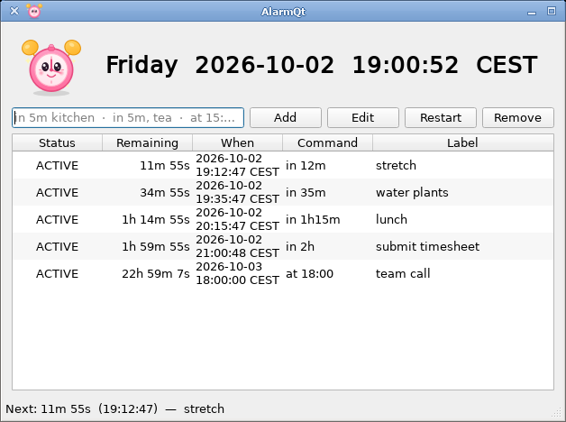

# AlarmQt

Simple system-tray alarm / reminder app for Linux (NixOS-friendly).



## Features

- **Relative & absolute alarms**
  - `in 5m`, `in 2h30m`, `in 1d`, `in 10 mins`, `in 2 hours`, `in 2 weeks`, `in 1 month`, `in 3 years`
  - `at 15:10`, `at 2026-10-03 09:00`, `at 2026-10-06 5:00pm`, `6:00pm`, `6am`, `noon`, `midnight`
  - `today 17:00`, `tomorrow 9:00`, `next monday 5:50pm`, `monday 9:00`
  - glued zone on absolute times: `at 15:10CEST`, `at 12:00Z`, `at 15:10+02:00` (space starts a label)
  - repeating: `every 5m`, `every monday at 18:00`, `every mon, thu 6pm`,
    `daily at 7:30`, `every weekday at 9:00`, `every month on the 6th at 9:00`
    (`each` / `monthly` work too)
  - optional note: `in 10m stretch`, `in 5m, water plants`, `at 15:10 team call`
    (also still accepts `(laundry)` / `"pick up kids"`)
- **Timezone-aware** (uses local timezone by default; stores absolute UTC instants)
- **Persistent** – alarms survive restarts (JSON under `$XDG_STATE_HOME/alarmqt/` (default `~/.local/state/alarmqt/alarms.json`))
- **Repeats until acknowledged** – always-on-top flashing dialog + tray balloon every 30 s until Ack / Snooze
- **System tray** – tooltip shows next alarm countdown; left-click toggles window, right-click menu
- **Single-instance** – starting the binary again focuses the existing window / sends CLI commands
- **Keyboard-driven**
  - `Ctrl+N` / focus line edit → type alarm → Enter
  - `F1` / **?** — full alarm time syntax with examples
  - `Delete` / `Ctrl+D` remove selected
  - `Ctrl+E` edit · `Ctrl+R` restart · `Ctrl+K` skip next (repeating)
  - `Space` / Enter on triggered dialog = Acknowledge
  - `Esc` hides window to tray
- **Countdown** shown for every alarm and in the tray tooltip
- **Current time** displayed prominently
- Finished alarms stay in the list as **DONE** (edit/remove manually)
- **Repeating alarms** (↻) re-arm on acknowledge instead of becoming DONE:
  intervals count from the acknowledgement, weekly ones keep their local
  wall-clock time across DST, and missed occurrences fire once, not once per
  missed slot. **Skip next** drops the upcoming occurrence.
- **Command** (expression) and **Label** (note) are separate columns
- **Edit** via double-click, Ctrl+E, or right-click
- **Restart** re-arms from the original command (Ctrl+R or right-click)
- **Clear DONE** from context menu or tray (removes finished alarms in bulk)
- Classic **QWidget** UI (no QML)

## Build (Nix)

```bash
nix build
./result/bin/alarmqt
# or
nix run
```

## CLI

```bash
alarmqt                    # start / raise
alarmqt "in 5m"            # add relative alarm
alarmqt "at 15:10"         # add absolute alarm
alarmqt --list
alarmqt --quit
```

A second process talks to the running instance over the session D-Bus
(`org.alarmqt.AlarmQt`). For scripting, prefer `busctl` (see `man alarmqt`);
the CLI does not mirror every method as a flag.

## Dependencies

- Qt6 (Core, Gui, Widgets, Network for local socket, Svg, Multimedia for the alarm sound)
- CMake ≥ 3.16
- C++20

## Desktop integration

Installed files (via CMake / Nix):

- `share/applications/alarmqt.desktop`
- `share/icons/hicolor/scalable/apps/alarmqt.svg`
- `share/metainfo/alarmqt.metainfo.xml`

The app sets `QGuiApplication::setDesktopFileName("alarmqt")` so the tray and window match the desktop entry (icon, notifications, single-window hints).

## Tests

```bash
cmake -B build -DALARMQT_BUILD_TESTS=ON
cmake --build build
ctest --test-dir build --output-on-failure
```

Nix builds run the same tests in the check phase.

## Manual

After install: `man alarmqt`

## Version

`VERSION` is the only source of truth. Development trees use a `-dev` suffix
(e.g. `0.1.0-dev`). Nix appends `.{revCount}+g{shortRev}` for dev builds.
`alarmqt --version` prints the full string.

## License

GPL-3.0-or-later. The project follows the [REUSE](https://reuse.software/)
specification; check with `reuse lint`.
